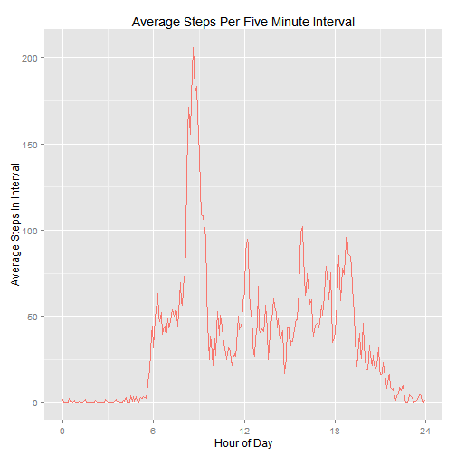

# Reproducible Research: Peer Assessment 1
The data set consists of observations from a "personal activity monitoring device" over 61 days in October and November, 2012. It gives the number of steps taken by the wearer during each five minute interval. Though it is not stated explicitly, for purposes of this analysis we'll assume that the logged times are the starting times of the measured intervals.

## Loading and preprocessing the data

We'll set a data directory, load some libraries for later use, and then load the initial data set into a dplyr-compatible data frame:


```r
setwd("~/Coursera/class05/proj01")
library(dplyr)
library(lubridate)
library(ggplot2)

activity <- tbl_df(read.csv("activity.csv", stringsAsFactors = FALSE))
```

The interval variable represents the time as a human-readable integer, with hours in the hundreds place (e.g., "1155", "1200", "1205"). Used directly, this would distort the timings due to the numeric difference of 45 for the five minute difference between the "55" and the following "00" observations. Therefore, we'll add a variable representing the number of minutes since midnight using integer division and modulo:


```r
activity <- mutate(activity, 
          intervalMinute = (interval %/% 100 * 60) + (interval %% 100))
```

## What is mean total number of steps taken per day?

Summarizing the data per day, we get the following freqencies:


```r
actday <- activity %>% group_by(date) %>% summarize(totsteps = sum(steps))

hist(actday$totsteps / 1000, main = "Histogram: Steps Taken Per Day", 
     xlab = "Steps (thousands)", ylab = "Frequency", 
     ylim = c(0,33), col = "red", labels = TRUE)
```

 

Disregarding the missing values, this gives the mean and median steps per day:


```r
c( mean = mean(actday$totsteps, na.rm = TRUE) ,
   median = median(actday$totsteps, na.rm = TRUE) )
```

```
##     mean   median 
## 10766.19 10765.00
```

## What is the average daily activity pattern?

Looking at the average daily steps during each five-minute interval, again disregarding the missing values, shows this pattern:


```r
actinterval <- activity %>% 
     group_by(intervalMinute) %>% 
     summarize(avgsteps = mean(steps, na.rm = TRUE))

qplot(intervalMinute / 60, avgsteps, data = actinterval,
      geom = "line", color = "red",
      main = "Average Steps Per Five Minute Interval",
      ylab = "Average Steps In Interval", xlab = "Hour of Day") + 
     scale_x_continuous(breaks=c(0,6,12,18,24)) +
     guides(color = "none")
```

 

This gives the maximum average number of steps for an interval at:


```r
maxrow <- actinterval[which.max(actinterval$avgsteps),]

c(maxsteps = round(maxrow$avgsteps, 2),
     interval = format(origin + dminutes(maxrow$intervalMinute), "%H:%M"))
```

```
## maxsteps interval 
## "206.17"  "08:35"
```

## Imputing missing values

Out of 17568 total observations, 2304 have missing "steps" values.  (NOTE: Inline calcs using `nrow(activity)` and `sum(is.na(activity))`)

We can fill these in by using the mean values for the corresponding intervals on days for which we do have values, as calculated earlier. (We'll also add a "daytype" variable for later use.)


```r
actimp <- activity %>% 
     inner_join(actinterval) %>% 
     mutate(stepsImp = ifelse(is.na(steps),as.integer(round(avgsteps)),steps),
               daytype = as.factor(ifelse(wday(date) == 1 | wday(date) == 7, 
                                  "Weekend", "Weekday"))) %>% 
     select(date, intervalMinute, stepsImp, daytype)

actdayimp <- actimp %>% 
     group_by(date, daytype) %>% 
     summarize(totsteps = sum(stepsImp))
```

Looking at the updated distribution, the days which had missing data are understandably added to the middle bar:


```r
hist(actdayimp$totsteps / 1000, main = "Histogram: Steps Taken Per Day", 
     sub = "Includes imputed values",
     xlab = "Steps (thousands)", ylab = "Frequency", 
     ylim = c(0,39), col = "red", labels = TRUE)
```

 

The updated mean and median steps per day


```r
c( mean = mean(actdayimp$totsteps) ,
   median = median(actdayimp$totsteps) )
```

```
##     mean   median 
## 10765.64 10762.00
```

are only slightly changed from the original values which excluded the missng data:


```r
c( mean = mean(actday$totsteps, na.rm = TRUE) ,
   median = median(actday$totsteps, na.rm = TRUE) )
```

```
##     mean   median 
## 10766.19 10765.00
```

## Are there differences in activity patterns between weekdays and weekends?

Splitting the data between weekdays and weekends, some differences can be observed:


```r
actdayimp %>% group_by(daytype) %>% summarise_each(funs(mean, median), totsteps)
```

```
## Source: local data frame [2 x 3]
## 
##   daytype     mean median
## 1 Weekday 10255.29  10762
## 2 Weekend 12201.00  11646
```

Overall, more steps were taken during the weekends.


```r
actintervalimp <- actimp %>% 
     group_by(intervalMinute, daytype) %>% 
     summarize(avgsteps = mean(stepsImp))

qplot(intervalMinute / 60, avgsteps, data = actintervalimp,
     facets = daytype ~ ., geom = "line", color = "red",
     main = "Average Steps Per Five Minute Interval",
     ylab = "Average Steps In Interval", xlab = "Hour of Day") + 
     scale_x_continuous(breaks=c(0,6,12,18,24)) +
     guides(color = "none")
```

 

Weekdays have a higher peak just before 9:00 in the morning, while weekends show activity more spread out through the daytime hours.

---
